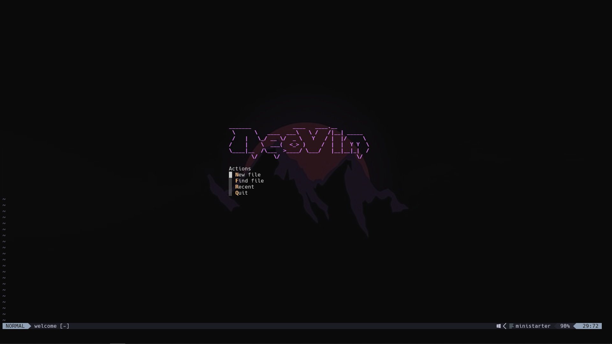
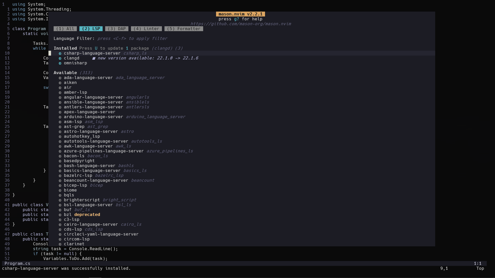
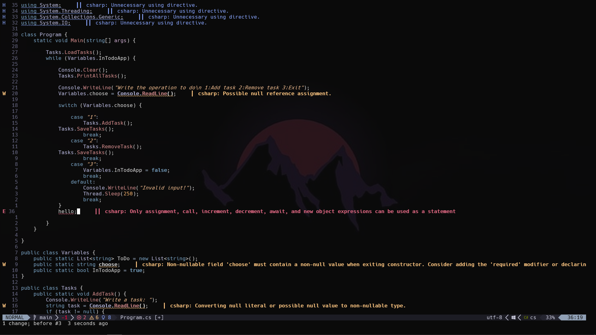

# Minimal Neovim Configuration
## This is a minimal neovim configuration. It uses lazy as its package manager.

## Features
  - Splash screen
  - Autocomplete and Lsp
  - Basic note taking feature
  - Language servers with Mason
  - Quick file navigation with Grapple.nvim
  - Floating terminal
  - NvimTree
  - Mnay useful keymaps
  - And many more...
---

## Some screenshots: 
#
Splash Screen (Main menu)
----


----
You can install various Language Servers.
----


----
You can use those language servers to see live errors, warning and hints.
-----


----

## How to install?

### Windows

1. Open PowerShell.
2. Clone the repository to your Neovim config directory:

``` bash
git clone https://github.com/PhaijooBaibhaav/nvim_config-Baibhav.git $env:LOCALAPPDATA\nvim
```
3. Open Neovim and run `:Lazy sync` (if using Lazy.nvim) to install plugins.

---

### macOS

1. Open Terminal.
2. Clone the repository:

``` bash
git clone https://github.com/PhaijooBaibhaav/nvim_config-Baibhav.git ~/.config/nvim
```
3. Open Neovim and run `:Lazy sync` to install plugins.

---

### Linux

1. Open a terminal.
2. Clone the repository:
```bash
git clone https://github.com/PhaijooBaibhaav/nvim_config-Baibhav.git ~/.config/nvim
```
3. Open Neovim and run `:Lazy sync` to install plugins.

---

## Thanks for visiting! Enjoy the neovim experience.
Made by: ***Baibhav Phaijoo***

